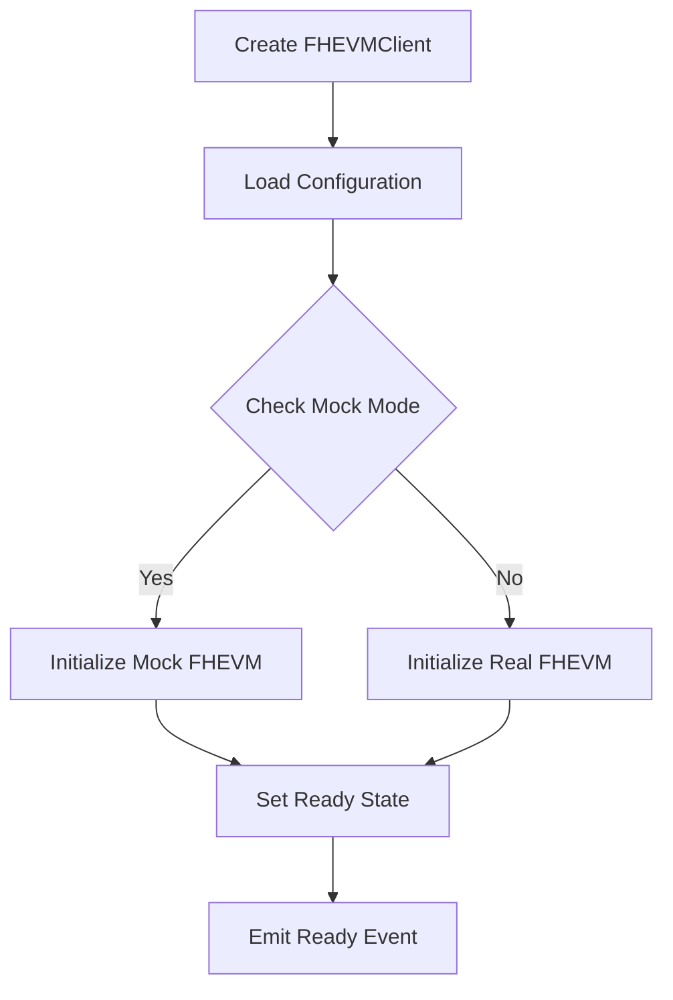

# Universal FHEVM SDK Architecture

## 🎯 Overview

The Universal FHEVM SDK is a framework-agnostic toolkit for building confidential dApps with fully homomorphic encryption on Ethereum. It provides a unified API across React, Vue, Node.js, and vanilla JavaScript environments.

## 🏗️ Core Architecture

### Design Principles

1. **Framework Agnostic**: Core logic separated from framework-specific implementations
2. **TypeScript First**: Full type safety and IntelliSense support
3. **Universal Compatibility**: Data encrypted in one framework works in another
4. **Developer Experience**: Mock mode, interactive CLI, zero-config setup
5. **Production Ready**: Real blockchain integration with comprehensive error handling

## 📦 Package Structure

```
@fhevm/sdk/
├── src/
│   ├── client.ts              # Core FHEVM client
│   ├── types.ts               # Shared type definitions
│   ├── FhevmDecryptionSignature.ts
│   ├── internal/              # Internal utilities
│   │   ├── fhevm.ts          # FHEVM instance management
│   │   ├── constants.ts      # Configuration constants
│   │   ├── mock/             # Mock mode implementation
│   │   ├── PublicKeyStorage.ts
│   │   └── RelayerSDKLoader.ts
│   ├── storage/               # Storage abstractions
│   │   ├── GenericStringStorage.ts
│   │   └── index.ts
│   ├── utilities/             # Utility functions
│   │   └── index.ts
│   ├── react/                 # React-specific implementation
│   │   ├── components/        # React components
│   │   ├── hooks/            # React hooks
│   │   └── index.ts
│   ├── vue/                   # Vue-specific implementation
│   │   ├── composables/       # Vue composables
│   │   └── index.ts
│   └── node/                  # Node.js-specific implementation
│       ├── cli.ts            # Command-line interface
│       ├── utilities.ts      # Node.js utilities
│       └── hooks/            # Node.js hooks
└── dist/                      # Built output
```

## 🔧 Core Components

### 1. FHEVMClient (Core)

The central client that manages FHEVM operations across all frameworks.

```typescript
class FHEVMClient {
  // Core methods
  initialize(): Promise<void>
  encrypt(value: number, options: EncryptionOptions): Promise<string>
  decrypt(options: DecryptionOptions): Promise<number>
  
  // State management
  getState(): FHEVMState
  getStatus(): FHEVMStatus
  isReady(): boolean
  
  // Lifecycle
  refresh(): Promise<void>
  destroy(): void
}
```

**Key Features:**
- **State Management**: Tracks initialization, errors, and ready state
- **Event System**: Emits status changes, errors, and ready events
- **Storage Abstraction**: Pluggable storage backends
- **Mock Mode**: Automatic detection and fallback

### 2. Storage Layer

Abstract storage interface supporting multiple backends:

```typescript
interface FHEVMStorage {
  get(key: string): Promise<string | null>
  set(key: string, value: string): Promise<void>
  remove(key: string): Promise<void>
  clear(): Promise<void>
}
```

**Available Implementations:**
- **IndexedDB**: Browser default (persistent)
- **localStorage**: Simple browser storage
- **In-Memory**: Node.js and testing
- **Custom**: User-defined implementations

### 3. Framework Adapters

#### React Adapter (`@fhevm/sdk/react`)

```typescript
// Hooks
const { encrypt, decrypt, isReady } = useFHEVM(config)
const { encryptValue } = useEncrypt()
const { decryptValue } = useDecrypt()

// Components
<FHEVMProvider config={config}>
  <EncryptButton value={42} onEncrypted={handleEncrypted} />
  <DecryptButton handle={handle} onDecrypted={handleDecrypted} />
</FHEVMProvider>
```

#### Vue Adapter (`@fhevm/sdk/vue`)

```typescript
// Composables
const { encrypt, decrypt, isReady } = useFHEVM(config)
const { encryptValue } = useEncryption()
const { decryptValue } = useDecryption()

// Usage in components
const handleEncrypt = async () => {
  const encrypted = await encryptValue(42, { publicKey: '0x...' })
}
```

#### Node.js Adapter (`@fhevm/sdk/node`)

```typescript
// Direct client usage
const client = createFHEVMClientForNode(config)
await client.initialize()

// CLI utilities
const encrypted = await encryptValue(42, publicKey, config)
const decrypted = await decryptValue(handle, contractAddress, config)
```

## 🔄 Data Flow

### 1. Initialization Flow



### 2. Encryption Flow

```mermaid
graph TD
    A[encrypt(value, options)] --> B[Validate Input]
    B --> C[Get FHEVM Instance]
    C --> D[Create Encrypted Input]
    D --> E[Call FHEVM Encrypt]
    E --> F[Return Handle]
    F --> G[Store in Cache]
```

### 3. Decryption Flow

```mermaid
graph TD
    A[decrypt(options)] --> B[Validate Handle]
    B --> C[Get FHEVM Instance]
    C --> D{Decryption Type}
    D -->|Public| E[Public Decrypt]
    D -->|User| F[User Decrypt with Signature]
    E --> G[Return Decrypted Value]
    F --> G
```

## 🛠️ Mock Mode Architecture

### Auto-Detection Logic

```typescript
function shouldUseMockMode(config: FHEVMConfig): boolean {
  // 1. Check explicit environment variable
  if (process.env.FHEVM_MOCK_MODE === 'true') return true
  
  // 2. Check for Windows platform (no FHEVM support)
  if (process.platform === 'win32') return true
  
  // 3. Check for localhost RPC (development)
  if (config.rpcUrl.includes('localhost')) return true
  
  // 4. Check for mock chain IDs
  if (config.chainId in config.mockChains) return true
  
  return false
}
```

### Mock Implementation

```typescript
class FHEVMMock {
  async encrypt(value: number): Promise<string> {
    // Simulate encryption with deterministic output
    return `0x${value.toString(16).padStart(64, '0')}`
  }
  
  async decrypt(handle: string): Promise<number> {
    // Simulate decryption
    return parseInt(handle.slice(2), 16)
  }
}
```

## 🔐 Security Architecture

### 1. Encryption Security

- **Public Key Validation**: Ensures valid Ethereum addresses
- **Handle Verification**: Validates encrypted handles before decryption
- **Input Sanitization**: Prevents injection attacks
- **Type Safety**: TypeScript prevents runtime type errors

### 2. Decryption Security

- **Signature Verification**: EIP-712 signature validation for user decryption
- **Contract Validation**: Ensures handles belong to specified contracts
- **Permission Checks**: Validates user permissions before decryption
- **Error Handling**: Secure error messages without information leakage

### 3. Storage Security

- **Encrypted Storage**: Sensitive data encrypted at rest
- **Access Control**: Framework-specific access patterns
- **Cleanup**: Automatic cleanup on client destruction
- **Isolation**: Framework-specific storage namespaces

## 🌐 Cross-Framework Compatibility

### Data Interchange Format

```typescript
interface EncryptedData {
  handle: string           // Encrypted handle
  contractAddress: string  // Contract address
  publicKey: string       // Encryption public key
  timestamp: number       // Creation timestamp
  framework: string       // Source framework
}
```

### Compatibility Matrix

| Framework | Encrypt | Decrypt | Storage | CLI |
|-----------|---------|---------|---------|-----|
| React     | ✅      | ✅      | IndexedDB | ❌ |
| Vue       | ✅      | ✅      | IndexedDB | ❌ |
| Node.js   | ✅      | ✅      | In-Memory | ✅ |
| Vanilla   | ✅      | ✅      | localStorage | ❌ |

## 🚀 CLI Architecture

### Command Structure

```typescript
program
  .command('init')           // Interactive setup
  .command('encrypt')        // Encrypt values
  .command('decrypt')        // Decrypt handles
  .command('batch-encrypt')  // Batch encryption
  .command('batch-decrypt')  // Batch decryption
  .command('status')         // Check status
  .command('test')           // Run tests
  .command('info')           // Show information
```

### Interactive Features

- **Setup Wizard**: Guided configuration and testing
- **Mock Mode Detection**: Automatic fallback for unsupported environments
- **Error Recovery**: Comprehensive error handling and troubleshooting
- **Progress Indicators**: Visual feedback for long operations

## 📊 Performance Considerations

### 1. Lazy Loading

- **FHEVM Instance**: Created only when needed
- **Storage Backends**: Loaded on first use
- **Framework Adapters**: Imported dynamically

### 2. Caching Strategy

- **Encrypted Handles**: Cached for reuse
- **Public Keys**: Cached per session
- **Configuration**: Cached after first load
- **FHEVM Instance**: Singleton pattern

### 3. Memory Management

- **Cleanup**: Automatic resource cleanup
- **Weak References**: Prevent memory leaks
- **Event Cleanup**: Remove listeners on destroy
- **Storage Cleanup**: Clear sensitive data

## 🔧 Error Handling Architecture

### Error Hierarchy

```typescript
FHEVMError
├── FHEVMNotInitializedError
├── FHEVMEncryptionError
├── FHEVMDecryptionError
└── FHEVMAbortError
```

### Error Recovery

- **Automatic Retry**: Network and temporary errors
- **Fallback Modes**: Mock mode when real FHEVM fails
- **User Guidance**: Clear error messages with solutions
- **Logging**: Comprehensive error logging for debugging

## 🧪 Testing Architecture

### Test Strategy

1. **Unit Tests**: Individual component testing
2. **Integration Tests**: Framework-specific testing
3. **E2E Tests**: Complete workflow testing
4. **Mock Tests**: Mock mode functionality
5. **Cross-Framework Tests**: Compatibility testing

### Test Utilities

```typescript
// Mock FHEVM for testing
const mockFHEVM = createMockFHEVM()

// Test configuration
const testConfig = {
  rpcUrl: 'http://localhost:8545',
  chainId: 31337,
  mockMode: true
}
```

## 🚀 Deployment Architecture

### Build Process

1. **TypeScript Compilation**: Source to JavaScript
2. **Module Bundling**: Framework-specific bundles
3. **Type Generation**: TypeScript declaration files
4. **Asset Optimization**: Minification and compression

### Distribution

- **NPM Packages**: Framework-specific packages
- **CDN Support**: Browser-compatible builds
- **Node.js Support**: CommonJS and ESM
- **Tree Shaking**: Optimized bundle sizes

## 📈 Future Architecture Considerations

### Planned Enhancements

1. **Web Workers**: Background FHEVM operations
2. **Service Workers**: Offline FHEVM support
3. **WASM Support**: Native FHEVM implementation
4. **Multi-Chain**: Support for additional blockchains
5. **Plugin System**: Extensible architecture

### Scalability

- **Horizontal Scaling**: Multiple FHEVM instances
- **Vertical Scaling**: Resource optimization
- **Caching Layers**: Distributed caching
- **Load Balancing**: Multiple RPC endpoints

## 🎯 Conclusion

The Universal FHEVM SDK architecture provides a robust, scalable, and developer-friendly foundation for building confidential dApps. Its framework-agnostic design, comprehensive error handling, and mock mode support make it accessible to developers across all skill levels and environments.

The modular architecture allows for easy extension and customization while maintaining compatibility across different frameworks and deployment environments.